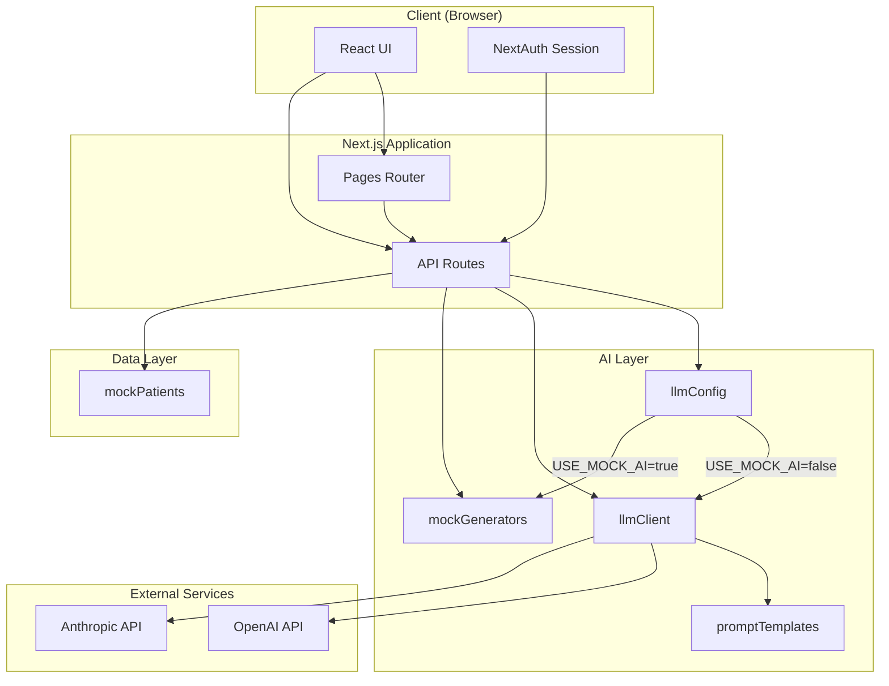
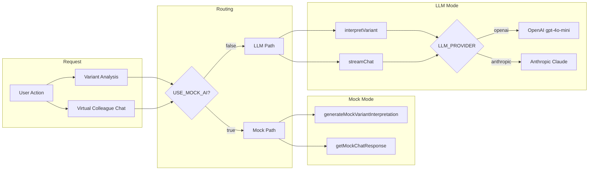
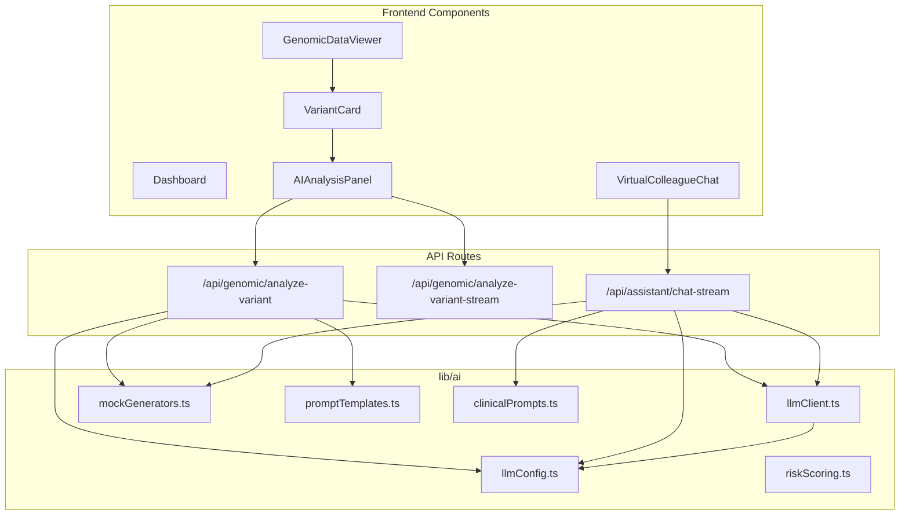
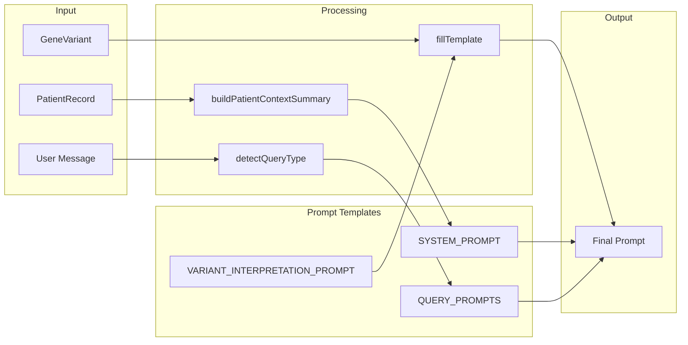

# Precision Medicine Platform — Technical Documentation for AI Engineer

> Technical overview of the AI/LLM integration, architecture, and design decisions for portfolio and interview use.

---

## 1. System Architecture

### 1.1 High-Level Architecture



### 1.2 AI Request Flow



### 1.3 Component Architecture



---

## 2. AI/LLM Integration Architecture

### 2.1 Mock vs LLM Switch Design

| Design Decision | Implementation |
|-----------------|----------------|
| **Single switch** | `USE_MOCK_AI` env var controls all AI features |
| **Fail-safe default** | Default `true` (mock) — no API key required for dev |
| **Provider abstraction** | `llmClient.ts` abstracts OpenAI vs Anthropic |
| **Unified interface** | Same API contract for mock and LLM paths |

### 2.2 LLM Client Interface

```
┌─────────────────────────────────────────────────────────────┐
│                     llmClient.ts                            │
├─────────────────────────────────────────────────────────────┤
│  interpretVariant(prompt, variant) → Promise<string>        │
│  streamChat(messages, systemPrompt, patientContext)         │
│       → AsyncGenerator<ChatStreamChunk>                     │
├─────────────────────────────────────────────────────────────┤
│  Providers: OpenAI (gpt-4o-mini), Anthropic (claude-3-haiku)│
│  Params: temperature=0.2, max_tokens=1024/2048              │
└─────────────────────────────────────────────────────────────┘
```

### 2.3 Prompt Engineering Pipeline



---

## 3. Key Technical Decisions

### 3.1 Prompt Engineering

| Decision | Rationale |
|----------|-----------|
| **Template-based prompts** | Reusable, versionable, easy to A/B test |
| **Explicit mechanistic cues** | "homologous recombination, HRD, PARP inhibitors" → richer clinical output |
| **Removed length constraints** | Original "2–4 sentences" limited detail; relaxed for clinical value |
| **Query-type routing** | `detectQueryType()` routes to drug/risk/treatment/literature prompts |

### 3.2 Streaming vs Batch

| Endpoint | Mode | Reason |
|----------|------|--------|
| `/api/genomic/analyze-variant` | JSON (batch) | Simple, cacheable, modal display |
| `/api/genomic/analyze-variant-stream` | SSE | Real-time UX, perceived latency |
| `/api/assistant/chat-stream` | SSE | Chat UX, reasoning + answer phases |

### 3.3 Rate Limiting

- **In-memory rate limiter** (`lib/ai/rateLimit.ts`)
- 30 requests/minute per IP for chat
- Prevents abuse, controls API cost

### 3.4 Error Handling

- LLM failures → 500 with `details` in JSON
- Missing API key → Clear error message
- Streaming errors → SSE `type: "error"` chunk

---

## 4. Data Models

### 4.1 Core AI Types

```typescript
// Variant input
interface GeneVariant {
  id: string;
  geneSymbol: string;
  codingChange: string;
  proteinChange?: string;
  acmgClassification?: string;
  clinVarSignificance?: string;
  // ...
}

// Chat output
interface ChatStreamChunk {
  type: "reasoning" | "chunk" | "recommendations" | "done";
  text?: string;
  recommendations?: RecommendationWithEvidence[];
  messageId?: string;
  confidence?: number;
}

// Recommendation (green/yellow/red)
interface RecommendationWithEvidence {
  id: string;
  title: string;
  status: "green" | "yellow" | "red";
  summary: string;
  confidence: number;
  citations?: Citation[];
}
```

---

## 5. Testing Strategy

| Layer | Tool | Coverage |
|-------|------|----------|
| **Unit** | Jest | `lib/ai/riskScoring.ts`, `computeBaselineRiskScores` |
| **Component** | React Testing Library | `VariantImpactBadge`, UI components |
| **Integration** | Direct script | `scripts/test-openai-direct.mjs` — OpenAI API |
| **E2E** | Playwright | (configured, optional) |

---

## 6. Environment Configuration

```bash
# AI mode
USE_MOCK_AI=false          # true = mock, false = real LLM
LLM_PROVIDER=openai        # openai | anthropic

# API keys (one required when USE_MOCK_AI=false)
OPENAI_API_KEY=sk-...
ANTHROPIC_API_KEY=sk-ant-...

# Optional model overrides
OPENAI_MODEL=gpt-4o-mini
ANTHROPIC_MODEL=claude-3-haiku-20240307
```

---

## 7. File Structure (AI-Related)

```
lib/ai/
├── llmConfig.ts       # USE_MOCK_AI, API keys, provider
├── llmClient.ts       # interpretVariant, streamChat (OpenAI/Anthropic)
├── mockGenerators.ts  # generateMockVariantInterpretation, getMockChatResponse
├── promptTemplates.ts # Variant interpretation prompts
├── clinicalPrompts.ts # Virtual Colleague system + query prompts
├── rateLimit.ts       # In-memory rate limiter
└── riskScoring.ts     # Rule-based risk (BRCA1, APOE, etc.)

pages/api/
├── genomic/analyze-variant.ts      # POST, JSON
├── genomic/analyze-variant-stream.ts # POST, SSE
└── assistant/chat-stream.ts        # POST, SSE, rate limited
```

---

## 8. Metrics & Outcomes

| Metric | Value |
|--------|-------|
| **LLM providers** | 2 (OpenAI, Anthropic) |
| **Prompt templates** | 5+ (variant, drug, risk, treatment, literature) |
| **Streaming endpoints** | 2 (variant-stream, chat-stream) |
| **Mock/LLM switch** | Single env var, zero code change |
| **Prompt iteration** | Validated via ChatGPT comparison; enhanced for mechanistic detail |

---

## 9. Architecture Diagram (Simplified)

```
┌──────────────────────────────────────────────────────────────────┐
│                         PRECISION MEDICINE PLATFORM               │
├──────────────────────────────────────────────────────────────────┤
│  ┌─────────────┐  ┌─────────────┐  ┌─────────────────────────┐  │
│  │  Dashboard  │  │   Genomic    │  │  Virtual Colleague      │  │
│  │  (Patients) │  │   Viewer    │  │  (Chat)                 │  │
│  └──────┬──────┘  └──────┬──────┘  └────────────┬──────────────┘  │
│         │                │                      │                  │
│         └────────────────┼──────────────────────┘                 │
│                          ▼                                         │
│  ┌─────────────────────────────────────────────────────────────┐  │
│  │                    API Routes (Next.js)                      │  │
│  │  /api/genomic/analyze-variant  /api/assistant/chat-stream   │  │
│  └────────────────────────────┬────────────────────────────────┘  │
│                               ▼                                    │
│  ┌─────────────────────────────────────────────────────────────┐  │
│  │              AI Layer (lib/ai/)                              │  │
│  │  ┌──────────┐  ┌──────────┐  ┌──────────┐  ┌──────────────┐ │  │
│  │  │llmConfig │  │llmClient │  │  Mock    │  │   Prompts    │ │  │
│  │  │(switch)  │──│(OpenAI/  │  │Generators│  │  (templates) │ │  │
│  │  └──────────┘  │Anthropic)│  └──────────┘  └──────────────┘ │  │
│  │                └────┬─────┘                                  │  │
│  └─────────────────────┼───────────────────────────────────────┘  │
│                        ▼                                          │
│  ┌─────────────────────────────────────────────────────────────┐  │
│  │              External: OpenAI API | Anthropic API             │  │
│  └─────────────────────────────────────────────────────────────┘  │
└──────────────────────────────────────────────────────────────────┘
```

---

## 10. Summary for AI Engineer Role

**Skills demonstrated:**
- LLM integration (OpenAI, Anthropic) with provider abstraction
- Prompt engineering and iterative refinement (concise → mechanistic)
- Mock/LLM switch for development and production
- Streaming (SSE) for real-time UX
- Rate limiting and error handling
- TypeScript, Next.js API routes, React

**Deliverables:**
- Working precision medicine demo with AI-powered variant interpretation and clinical chat
- Documented prompt comparison (app vs ChatGPT)
- Test suite (Jest, React Testing Library)
- Direct OpenAI test script for validation
